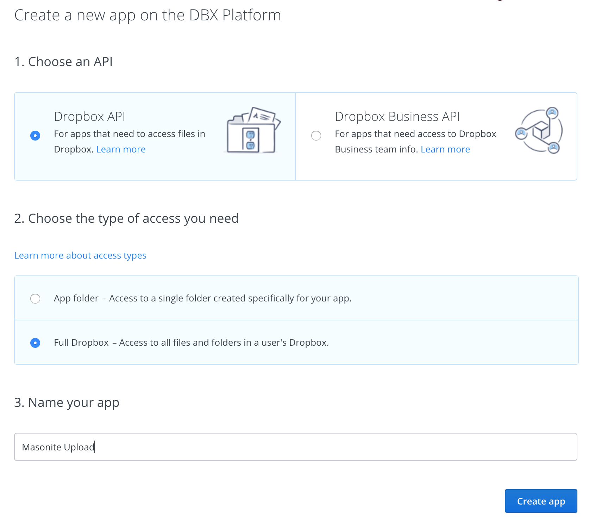
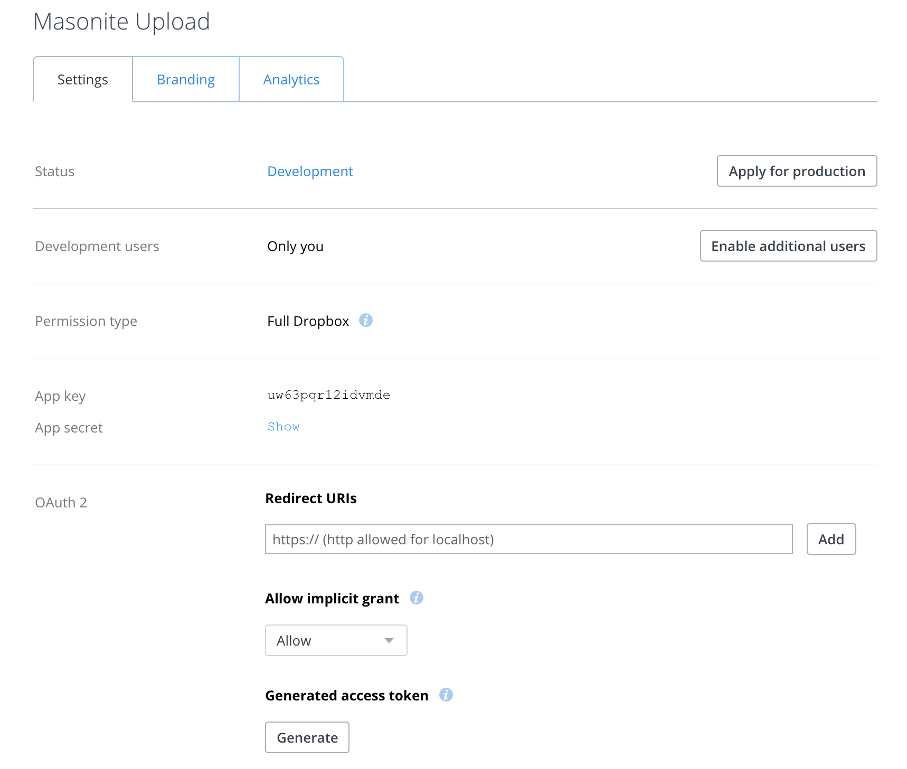

# Dropbox


**Github** [https://github.com/bjorntheart/masonite-dropbox-driver](https://github.com/bjorntheart/masonite-dropbox-driver)  
**Pypi**     [https://pypi.org/project/masonite-dropbox-driver](https://pypi.org/project/masonite-dropbox-driver)


## Requirements

In order to use the Dropbox upload driver, you'll need:

* Python 3.4+
* Pip3
* Masonite 2.0+
* dropbox 0.0.9+

## Getting Started

### Installation



```bash
$ pip install masonite-dropbox-driver
```



### Configuration

#### Dropbox

To upload files to your Dropbox we first need to create an **app** in the Dropbox Developers console. Head on over to [https://www.dropbox.com/developers/apps](https://www.dropbox.com/developers/apps). 

When you have click on the **Create app** button, you will be presented with the following screen



Fill out the details on the screen and give your **app** a name. 

In the next step you're required to generate a token to authenticate your app with. Click on the **Generate** button located under the **Generate access token** label. You will need the access token in the next step to configure Masonite.



#### Masonite

Paste the access token in your project's `.env` file along with the folder name where you want your uploads to be saved.



```text
DROPBOX_TOKEN=TpUPCQtBMS8CCCCABBAatYCqTxjibN8A7Do7zaISQaE0hLVvjb3iaAK8vKqEHuMW
DROPBOX_FOLDER=/Jake/
```



Add the _**DropboxProvider**_ to _**PROVIDERS**_ in the `config/providers.py` file.



```python
from masonite.contrib.dropbox.providers import DropboxProvider

PROVIDERS = [
    # Third Party Providers
    DropboxProvider,
]
```



## Using the Driver



```python
class ActivityController:

    def create(self, View):
        return View('admin/activities/new')

    def store(self, Upload, Request):
        Upload.driver('dropbox').store(Request.input('file_upload'))
        return Request.redirect_to('dashboard')
```



